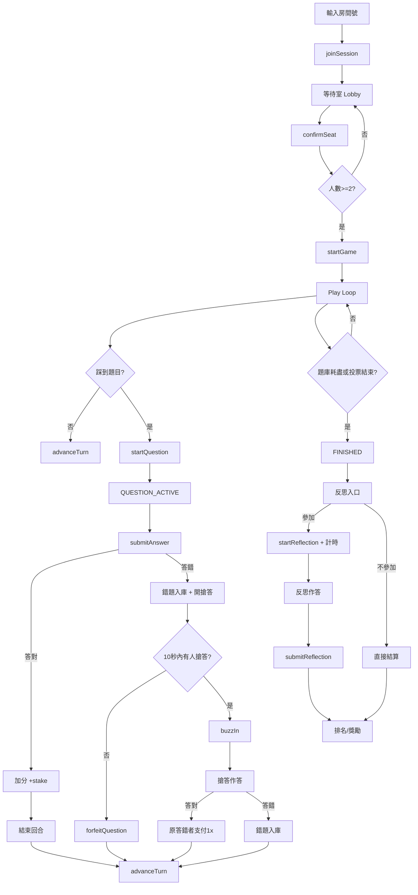

# 流程樹狀圖

本文件整理完整遊戲流程、狀態機、計分規則、API 觸發點與前端頁面行為。

## 1) 主要角色與資料結構
- Session（房間）
  - code: 2 位數字房間號
  - players: 玩家清單
  - gameState: LOBBY | TURN_ACTIVE | QUESTION_ACTIVE | FINISHED
  - currentPlayerId: 當前回合玩家
  - activeResponderId: 當前答題者（含搶答）
  - currentQuestion: 當前題目
  - usedQuestionIds / wrongQuestionIds
  - reflectionQuestionIds: 反思題集合
  - answerResult: 作答結果
  - buzzOpen / buzzReadyAt / buzzWinnerId
  - paidBuzzUsedIds: 已用過付費搶答玩家
  - reflectionStats / reflectionSettled
  - endVotes: 提前結束投票清單

- Player
  - id, seatNumber, name, confirmed, chips

- Question
  - id, category, type (single/multi/boolean)
  - difficulty (易/中低/中/中高/難)
  - options, answerIndices, explanation

## 2) 全流程樹狀圖（功能節點）
- 入口與房間
  - 輸入 2 位數房間號
  - joinSession
    - 建立 Session（若不存在）
    - 加入 Player（seatNumber 自動分配）
  - Lobby（等待室）
    - 輸入名稱
    - confirmSeat（座位確認）
    - startGame（至少 2 人確認）

- 遊戲主流程（Play Loop）
  - Turn Allocation（回合分派）
    - currentPlayerId 指向本回合玩家
  - 回合選擇
    - 有踩到題目 → startQuestion
    - 沒踩到題目 → advanceTurn

- 題目流程（Question Flow）
  - startQuestion
    - 從題庫挑未使用題目
    - questionLock = true, gameState = QUESTION_ACTIVE
  - 作答提交 submitAnswer
    - 正確：
      - 計分（單選/是非：+stake；複選：依正確選項數累加）
      - answerResult.isCorrect = true
      - 等待「結束回合」
    - 錯誤：
      - wrongQuestionIds 收錄
      - 開啟付費搶答視窗 buzzOpen = true（10 秒）

- 付費搶答（Paid Buzz）
  - buzzIn
    - 檢查：
      - 非原答錯者
      - 未使用過付費搶答
      - 籌碼足夠
      - 在倒數時間內
    - 扣除 10 萬
    - activeResponderId = buzzWinnerId
  - 搶答作答
    - 正確：
      - 轉帳：原答錯者 → 搶答者（1x 題目籌碼）
    - 錯誤：
      - 進錯題庫
      - 直接結束該題並回合遞進
  - 無人搶答：
    - forfeitQuestion → 回合遞進

- 回合結束
  - only 答題者可結束
  - 正確：advanceTurn
  - 錯誤且無搶答：forfeitQuestion

- 終局（Endgame）
  - 題庫耗盡 → gameState = FINISHED
  - 提前結束投票 voteEndGame
    - 達成半數 → gameState = FINISHED
    - 仍保留錯題進反思流程

- 反思（Reflection）
  - 入口選擇：
    - 參加 → startReflection 計時開始
    - 不參加 → 直接結算
  - 反思作答
    - 題目來源：前測錯題（wrongQuestionIds）
    - 計時方式：進入反思頁 → 完成所有題目
    - 每題限時 15 秒
  - submitReflection
    - 記錄總耗時 totalTime
    - 記錄答對題數 correctCount

- 排名與獎勵
  - 排名規則：答對題數優先，耗時次之
  - 獎勵：
    - 第 1 名：50 萬
    - 第 2 名：25 萬
    - 第 3 名：10 萬
  - 非參與者：不領取反思獎勵，僅顯示籌碼

## 3) 計分規則（題目作答）
- 難度對應籌碼：
  - 易 200,000
  - 中低 300,000
  - 中 500,000
  - 中高 600,000
  - 難 700,000

- 單選 / 是非
  - 答對：+stake
  - 答錯：-stake

- 複選
  - 答對一選項：+200,000
  - 全對最高不超過 stake
  - 全錯：-stake
  - 部分錯誤不扣分

- 付費搶答
  - 先扣 10 萬
  - 搶答答對：原答錯者支付 1x stake 給搶答者
  - 搶答複選題需全對才給籌碼
  - 搶答答錯：搶答者不退回，維持扣款

## 4) 前端頁面行為
- / (首頁)
  - 輸入 2 位數房間號
  - joinSession → /lobby

- /lobby
  - 座位確認 confirmSeat
  - 開始遊戲 startGame

- /play
  - 回合同步（2s polling）
  - 回合選擇：踩到題目 / 無題目
  - 搶答提示與倒數顯示

- /question
  - 題目作答
  - 搶答作答
  - 結束回合（僅答題者）

- /reflect
  - 反思參與選擇
  - 反思題目作答與計時
  - 排名與派獎

## 5) API 觸發點
- /api/session/join
- /api/session/confirm
- /api/session/start
- /api/session/advance
- /api/session/question/start
- /api/session/question/answer
- /api/session/question/buzz
- /api/session/question/forfeit
- /api/session/reflect/start
- /api/session/reflect/submit
- /api/session/reflect/settle
- /api/session/end
- /api/session/state

## 6) 錯誤與防護
- 房間號驗證（2 位數）
- 扣分不可負數（最低 0）
- 付費搶答每局一次
- 原答錯者不可搶答
- JSON 回應非 JSON 會提示錯誤

## 7) 資料儲存
- 公網部署：Vercel KV（Redis）
- 本機開發：記憶體 Map

---

## Mermaid 版本（可貼進 Markdown Viewer）

